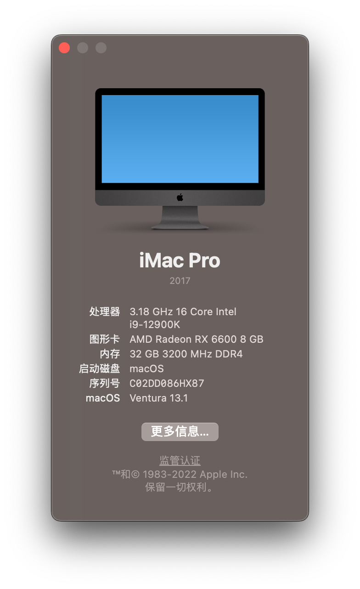
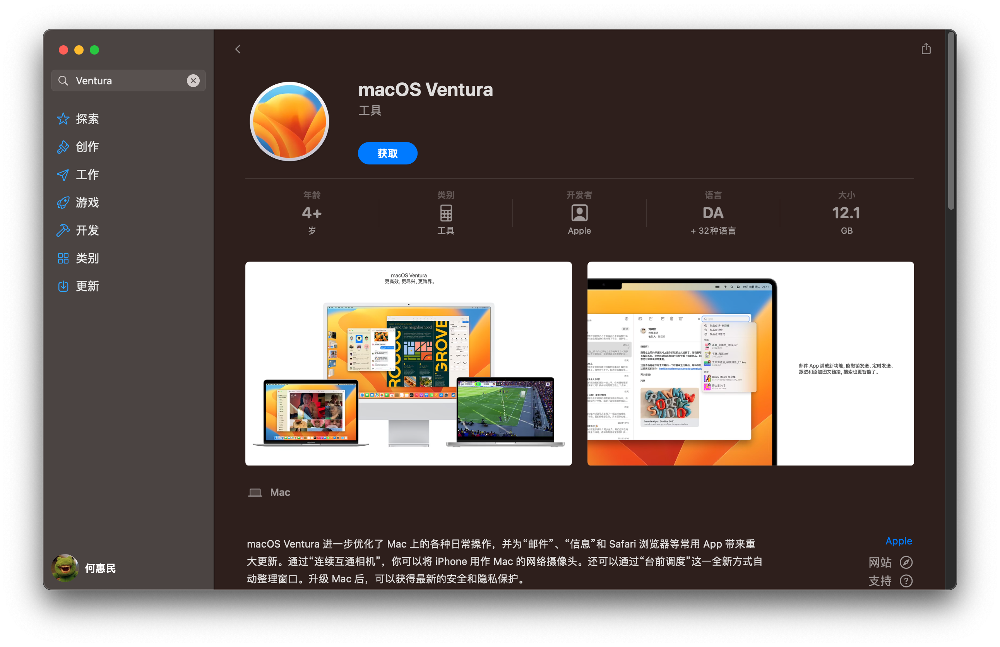

# 技嘉 B660M AORUS PRO AX 安装黑苹果



- 系统配置

| 类型 | 明细 |
| ---- | ---- |
| 主板 | 技嘉 B660M AORUS PRO AX DDR4 |
| CPU | 12th Gen Intel(R) Core(TM) i9-12900K|
| 内存 | 2 x Kingston 16GB 3200MHz DDR4 |
| 显卡 | 憾讯 AMD RX 6600 8GB |
| 硬盘 | Lexar 512G Nvme SSD |
| 声卡 | Realtek ALC897 |
| 无线/蓝牙| Apple BCM94360CD Wireless Card |
| 有线网口 | Intel Ethernet I-225V |
| BIOS 版本 | F21 |

## 1. 刻录 macOS 镜像

### 1.1 从 App Store 下载 Ventura 

在 App Store 或[在线的 App Store](https://www.apple.com/us/search/macOS?src=serp) 搜索 Ventura 并安装



### 1.2 格式化并分区移动磁盘

使用磁盘工具格式化磁盘，选择抹掉，格式选择 "Mac OS 扩展（日志式）"；方案选择 GUID 分区图；这样就会将移动磁盘分为两个分区，一个是 EFI分区，另一个是系统镜像分区


### 1.3 将 macOS 刻录到移动磁盘

下载完 macOS 安装器后，即可通过安装器将镜像刻录到移动磁盘；在命令行执行以下命令，Volume 即为刚才分区时命名的分区名称

```bash
sudo /Applications/Install\ macOS\ Ventura.app/Contents/Resources/createinstallmedia --volume /Volumes/macOS
```

等待执行完成即可

### 1.4 配置 EFI 

EFI 基于 [https://github.com/taruyato/b660m-aorus-pro-hackintosh](https://github.com/taruyato/b660m-aorus-pro-hackintosh) 修改而来；添加了 CPU，序列号等信息

首先将 EFI 分区挂载到电脑上；可以使用 `diskutil list` 命令查看 EFI 的 ID，然后使用命令行将 EFI 分区挂载

```bash
sudo mkdir /Volumes/efi
sudo mount -t msdos /dev/disk2s1 /Volumes/efi
```

## 2 安装 macOS

### 2.1 修改 BIOS 配置

建议先将 BIOS 升级到最新版本；进入配置后选择将所有的配置恢复到默认之后再配置，避免因为其他配置被改动导致出现问题

##### Tweaker:

* Advanced CPU Settings:
  - Hyper-Threading Technology: Enabled
  - Intel Turbo Boost Technology: Enabled
  - Legacy Game Compatibility Mode: Disabled
  - AVX: Enabled
* Extreme Memory Profile: Profile1

##### Settings:

* IO Ports:
  - Above 4G Decoding: Enabled
  - Re-Size BAR Support: Enabled (if you have RX 6000 Series)
  - Super IO Configuration > Serial Port: Enabled
  - USB Configuration > XHCI Hand-off: Enabled
  - Network Stack Configuration > Network Stack: Disabled
* Miscellaneous:
  - Intel Platform Trust Technology: Disabled
  - VT-d: Disabled
  - Trusted Computing > Security Device Support: Disable

##### Boot: 

- CFG Lock: Disabled
- Fast Boot: Disable Link
- Windows 10 Features: Other OS
- CSM Support: Disabled

修改启动项，关闭其他启动项
将核心显卡改为自动

关闭安全启动

### 2.2 安装 macOS 

按照指引安装 macOS 即可，中途会重启多次；如果出现重启后找不到启动项，可以将移动硬盘拔掉重新插入再重启

等待安装完成，即可进入 macOS 配置，按照指引配置即可