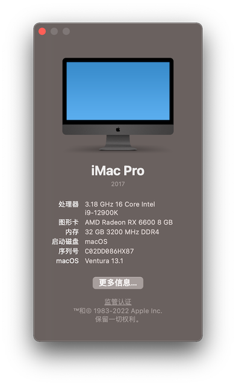
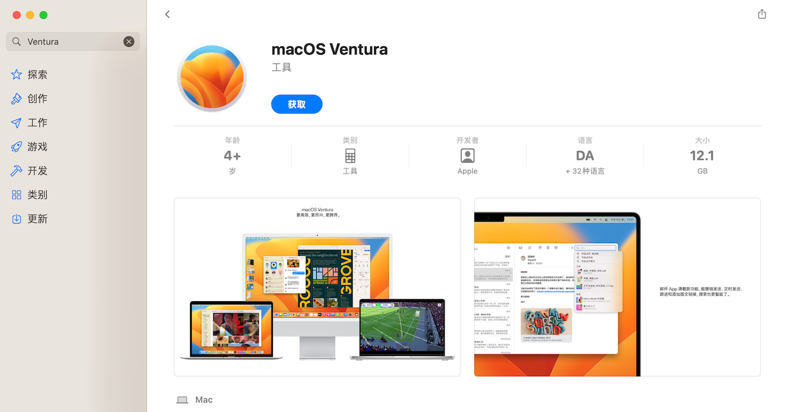

# 技嘉 B660M AORUS PRO AX 安装黑苹果



- 系统配置

| 类型      | 明细                                 |
| --------- | ------------------------------------ |
| 主板      | 技嘉 B660M AORUS PRO AX DDR4         |
| CPU       | 12th Gen Intel(R) Core(TM) i9-12900K |
| 内存      | 2 x Kingston 16GB 3200MHz DDR4       |
| 显卡      | 憾讯 AMD RX 6600 8GB                 |
| 硬盘      | Lexar 512G Nvme SSD                  |
| 声卡      | Realtek ALC897                       |
| 无线/蓝牙 | Apple BCM94360CD Wireless Card       |
| 有线网口  | Intel Ethernet I-225V                |
| BIOS 版本 | F21                                  |

## 1. 刻录 macOS 镜像

### 1.1 从 App Store 下载 Ventura 

在 App Store 或[在线的 App Store](https://www.apple.com/us/search/macOS?src=serp) 搜索 Ventura 并安装



### 1.2 格式化并分区移动磁盘

使用磁盘工具格式化磁盘，选择抹掉，格式选择 "Mac OS 扩展（日志式）"；方案选择 GUID 分区图；这样就会将移动磁盘分为两个分区，一个是 EFI分区，另一个是系统镜像分区


### 1.3 将 macOS 刻录到移动磁盘

下载完 macOS 安装器后，即可通过安装器将镜像刻录到移动磁盘；在命令行执行以下命令，Volume 即为刚才分区时命名的分区名称

```bash
sudo /Applications/Install\ macOS\ Ventura.app/Contents/Resources/createinstallmedia --volume /Volumes/macOS
```

等待执行完成即可

### 1.4 配置 EFI 

#### 修改配置信息

需要先修改 `config.plist` 文件中的配置

- CPU 信息


- 序列号信息


#### 将 EFI 添加到移动磁盘的 EFI 分区

EFI 基于 [https://github.com/taruyato/b660m-aorus-pro-hackintosh](https://github.com/taruyato/b660m-aorus-pro-hackintosh) 修改而来；添加了 CPU，序列号等信息

首先将 EFI 分区挂载到电脑上；可以使用 `diskutil list` 命令查看 EFI 的 ID，然后使用命令行将 EFI 分区挂载

```bash
sudo mkdir /Volumes/efi
sudo mount -t msdos /dev/disk2s1 /Volumes/efi
```

## 2 安装 macOS

### 2.1 修改 BIOS 配置

建议先将 BIOS 升级到最新版本；进入配置后按 F7 将所有配置都恢复到默认之后再配置，避免因为其他配置被改动导致出现问题；选择高级模式进行配置：

| 菜单          | 功能                   | 选项                           | 值       | 备注 | 
|:------------ |:--------------------- |:----------------------------- | :------- | :--- |
| 频率/电压控制   | 进阶处理器设置           | Hyper-Threading 技术            | 启动     |      |
|               |                        | Intel 涡轮加速技术               | 启动     |      |
|               |                        | Legacy Game Compatibility Mode | 关闭     |      |
|               |                        | AVX: Enabled                   | 启动     |      |
|               | Extreme Memory Profile |                                | Profile1 |      |
| 设置           | IO Ports               | Internal Graphics              | 自动     | CPU有核显时配置  |
|               |                        | 4G以上解码                       | 启动     |      |
|               |                        | Re-Size BAR Support            |开启     |    如果使用6600系列显卡时开启  |
|               |                        | Super IO 配置 > Serial Port     | 启动     |      |
|               |                        | USB 程序 > XHCI Hand-off        | 开启     |      |
|               |                        | Network Stack Configuration > Network Stack | 关闭   |      |
|               |Miscellaneous            | Intel Platform Trust Technology(PTT)| 关闭     |  |
|               |                        | VT-d                           | 关闭     |      |
|               |                        | Trusted Computing > Security Device Support | 关闭     |      |
| 开机功能设置    |                        | CFG Lock                       | 关闭     |  |
|               |                        | 快速启动                         | 停用连接     |      |
|               |                        | Windows 10 功能                 | 其他操作系统     |      |
|               |                        | CSM 支持                         | 关闭     |      |
|               |                        | Secure Boot > Secure Boot       | 关闭     |      |


### 2.2 安装 macOS 

按照指引安装 macOS 即可，中途会重启多次；如果出现重启后找不到启动项，可以将移动硬盘拔掉重新插入再重启

等待安装完成，即可进入 macOS 配置，按照指引配置即可
